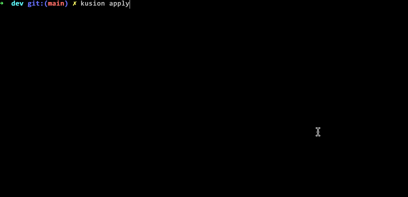

# Go代码城市上云——KusionStack实践

KusionStack 是面向 Kubernetes 云原生场景的 IaC 配置代码化实践的一站式可编程协议栈。其基本思想是让 应用方+平台方 的同学能够共同基于 IaC 构建的 Konfig 模型库进行 DevOps 工作。今天我们和大家分享一个好玩的Go代码城市应用，然后KusionStack一键将其部署到K8S云原生环境。

> KusionStack 项目主仓库：https://github.com/KusionStack/kusion

## 1. 什么是代码城市(CodeCity)

CodeCity代码城市是瑞典工程师Richard Wettel就通过其开发的创意应用，可以通过类似数字城市的视觉形式展示和度量代码的复杂性。其效果如图：


在3D形式展示的代码城市中的中心地标非常直观——最大、最高的建筑总是容易追踪的焦点。因为这个极具特色的创意，CodeCity获得了2008年的"Riconoscimento ated-ICT Ticino" 一等奖，同时也可以免费用于非商业的科研和学习用途。

今天要展示的 GoCity 是 Go 语言版本的代码城市，我们可以通过这种方式评估 KusioStack 等 Go 语言项目的代码复杂度。也可以通过在线的 GoCity 查看 [KusionStack/kusion](https://go-city.github.io/#/github.com/KusionStack/kusion) 仓库的展示效果。

## 2. 本地执行Go代码城市

之前的 GoCity 还是在2021年10月更新，在最新的 Docker 和 Go1.18 环境有一些小问题。还好 KusionStack 相关同学为其提交了补丁进行了修复（这也是开源项目的魅力所在，也希望开源社区小伙伴能够参与 KusionStack 的共建），现在可以执行以下命令安装：`go install github.com/rodrigo-brito/gocity@latest` 。然后通过 `gocity open` 打开Github或本地仓库。

比如打开本地的 `KusionStack/kusion` 仓库：

```
$ gocity open $HOME/go/src/github.com/KusionStack/kusion
INFO[0000] Visualization available at: http://localhost:4000/#/local 
```

然后浏览器打开对应页面：


本地执行一切正常！

## 3. Go代码城市一键上云

作为一个类似数字城市的应用，在云原生、元宇宙等背景下，部署上云也是一个自然的需求。同时我们也希望通过 GoCity 展示下 KusionStack 的基本用法。在 GoCity 上云之前，我们先尝试如何本地执行该应用。

相应的容器镜像已经推送到 [Docker Hub](https://hub.docker.com/r/yuanhao1223/gocity)，运行命令如下：

```bash
docker run -d -p 4000:4000 yuanhao1223/gocity:latest
```

运行成功后，可打开本地地址（http://localhost:4000）指定的 Go 项目，查看它的数字城市 3D 效果。

容器化成功后，现在准备上云。从本地执行容器的方式可以看出，想要在 Kubernetes 部署并访问，至少需要 Deployment 和 Service 两种资源。其中 Deployment 用来部署 Go 代码城市，Service 暴露端口，访问无状态应用。

首先参考 [安装文档](https://kusionstack.io/docs/user_docs/getting-started/install/) 安装好本地 Kusion 命令，然后克隆 [konfig 大库](https://github.com/KusionStack/konfig)，最后在大库的根目录下，通过 `kusion init` 的在线仓库选择相应模板。kusion 命令支持一键初始化配置：

```bash
kusion init --online
```

输出类似以下信息：


为了方便展示，Kusion 模板已经内置了 CodeCity 的例子。其中 code-city 模板引用了 konfig 大库中抽象化的 [Kusion 模型库](https://kusionstack.io/docs/reference/model/concept)，选择 code-city 模版，开始初始化，可以使用模板默认参数，也可以接受用户自定义。初始化过程如下：


初始化过程中，指定了容器镜像，并且容器端口和 Service 端口均为 4000；最终生成的项目遵循 [Project&Stack](https://kusionstack.io/docs/user_docs/concepts/project-stack) 设计，详细结构如下：

```
code-city
├── base
│   └── base.k
├── dev
│   ├── ci-test
│   │   └── settings.yaml
│   ├── kcl.yaml
│   ├── main.k
│   └── stack.yaml
└── project.yaml
```

> 模板完整的代码可以参考：https://github.com/KusionStack/kusion-templates/tree/main/code-city

到此，开始正式上云。首先在本地启动测试集群：

```bash
minikube start
```

> 有关 minikube 的操作指南，请看这里：https://minikube.sigs.k8s.io/docs/

进入 stack 目录：

```bash
cd code-city/dev
```

再执行命令：

```bash
kusion apply
```

输出类似于：



检查 Deployment 的状态：

```bash
kubectl get deploy -n code-city
```

输出类似于：

```
NAME           READY   UP-TO-DATE   AVAILABLE   AGE
code-citydev   1/1     1            1           28s
```

使用 kubectl 端口转发，在本地访问集群地址：

```bash
kubectl port-forward svc/gocity 4000:4000 -n code-city
```

访问本地地址（https://localhost:4000），点击 Example 处的链接 “KusionStack/kusion”，可以看到和本地执行一样的效果：


至此，完成了 Go 代码城市的一键上云。有兴趣的读者，可以基于模型库 Konfig，选择其他模板，探索 KusionStack 支持的其它运维场景。下面我们将探索下代码城市内部的原理。

## 4. 认识数字城市中的建筑含义

说实话代码城市第一眼看上去更像一个电路板。要理解其中的含义需要了解几个基本的参数映射关系，如预览页面的右下角图所示：


以上的对应关系在其官方文档中也说明，如下图所示：


其中地面的粉红色表示Go包对应的目录（因为包的依赖关系可能再产生叠加），灰色表示目录内部的文件，而蓝色表示结构体。其中表示文件的灰色建筑物的大小表示文件的大小，表示结构体的蓝色建筑物的高度表示方法的数量、建筑物的长宽表示结构体中属性的数量、蓝色颜色的深度表示相关代码行数。

我们可以选择 `DiffOptions` 结构体对应建筑物查看其相关的属性参数：


可以看到该结构体中有15个属性、3个方法共156行代码。通过点击其中的 “Github链接” 按钮可以跳转到对应的位置：


因此通过这种方式我们可以很容易查看全局有无特别高大的建筑，从而判断是否存在某些文件和结构体的代码需要改进。可以说GoCity 是一个很有趣的代码分析工具，甚至可以集成到 Github PR 代码评审流程中。

## 5. 分析 GoCity 的代码架构

GoCity代码架构主要分为代码数据提取和前端模型展示两块，如图所示：


首先 Codebase 表示要展示的代码，通过 GitService 被拉取，然后通过 Parser 和 Position 服务提取得到对应的参数信息，然后通过前端展示。Go 语言代码主要集中在模型数据提取部分，而前端展示主要为JS等实现。前端展示资源文件通过 `embed.FS` 内嵌到程序中，GoCity 命令启动 Web 服务展示页面。代码架构比较清晰，也是一个比较理想可用于Go语言学习的开源项目。

## 6. 总结

我们通过 KusionStack 的方式配合少量的 KCL 配置代码完成了 Go 代码城市一键上云的操作。虽然云上的Go代码城市和本地的版本看不出什么区别，但是云上程序的整个生命周期管理将大为不同。在后面的例子中我们将展示如何通过 KusionStack 结合 KCL配置语言 进行 IaC 方式的云原生应用的运维操作。感谢关注🙏 

## 参考链接

- https://github.com/KusionStack/kusion
- https://github.com/KusionStack/examples
- https://github.com/rodrigo-brito/gocity
- https://wettel.github.io/codecity.html

